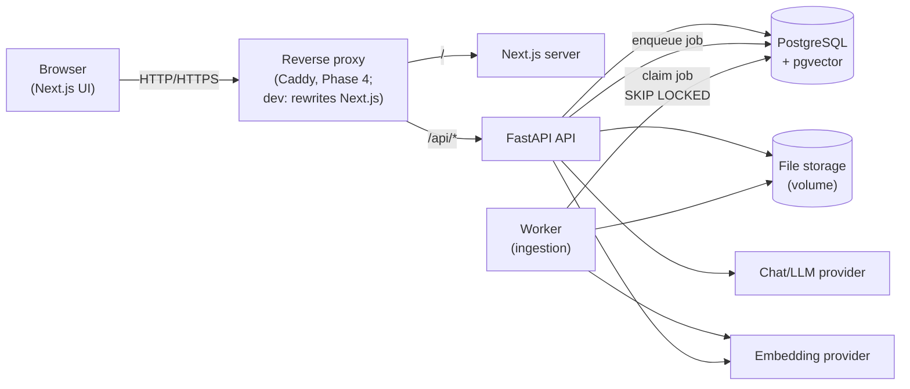
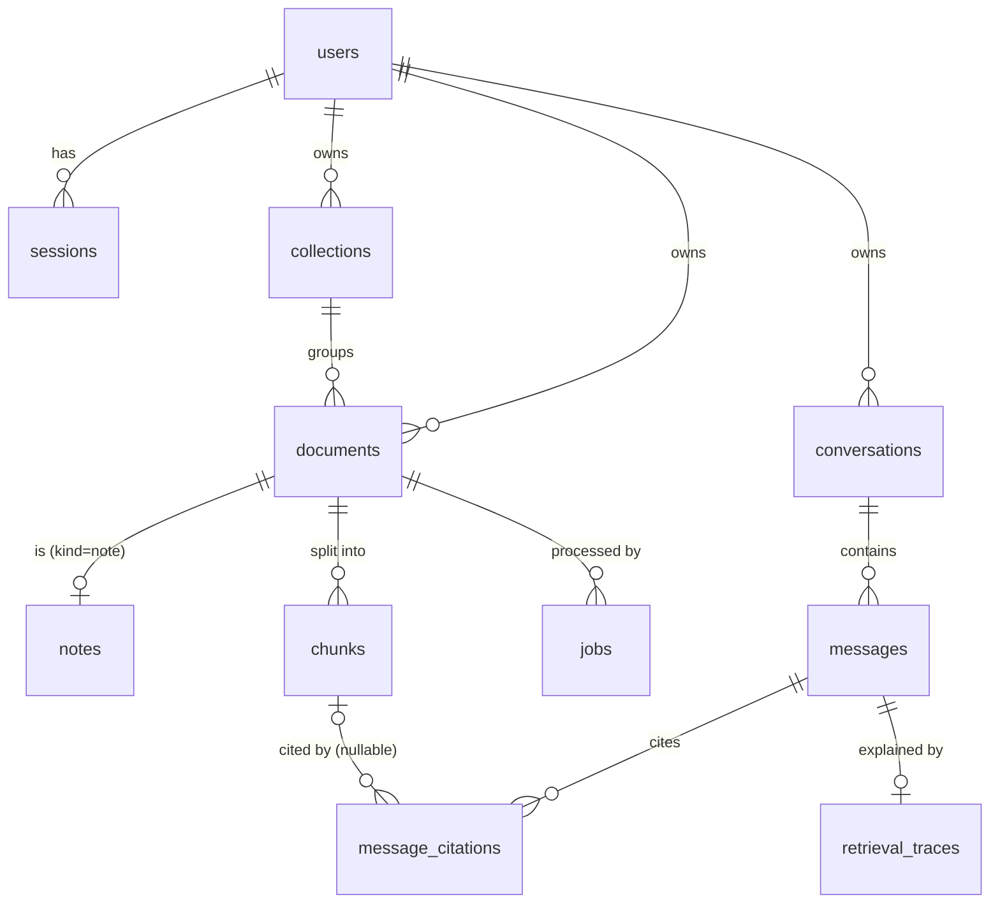
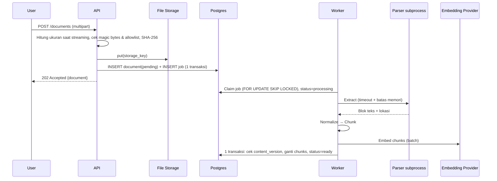
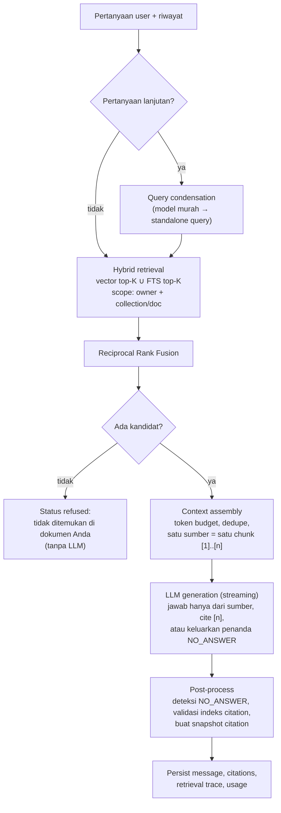

# KnowVault — Architecture & Project Discovery

> Status: **v0.5** — Phase 1–2 dan vector search Phase 3 diimplementasikan; keputusan implementasi dicatat di `docs/adr/`.
> Tanggal: 2026-09-29
> Pemilik: Fathul2703
>
> Dokumen ini adalah sumber kebenaran untuk keputusan arsitektur tingkat tinggi.
> Keputusan detail yang berubah di kemudian hari dicatat sebagai ADR di `docs/adr/`
> dan dokumen ini diperbarui agar tetap konsisten.

### Riwayat revisi

| Versi | Perubahan utama |
|---|---|
| v0.1 | Draft awal discovery & arsitektur. |
| v0.2 | Hasil architecture review: penyederhanaan (tanpa MinIO, tanpa tabel embedding terpisah, tanpa soft delete, lapisan clean architecture hanya di modul yang punya logika, CI bertahap); perbaikan desain citation (snapshot, satu `[n]` = satu chunk, lokasi non-PDF); evidence gate tidak lagi bergantung pada threshold yang belum dikalibrasi; label eval berbasis teks bukti, bukan ID chunk; registrasi berbasis undangan; CSRF via verifikasi `Origin`; parser di subprocess dengan timeout; aturan koneksi DB saat streaming; rate limit berbasis Postgres. |
| v0.3 | Penyesuaian saat implementasi Phase 1 (ADR 0001–0003): npm menggantikan pnpm; Caddy ditunda ke Phase 4 dan dev memakai rewrites Next.js; test memakai Postgres nyata via `TEST_DATABASE_URL` alih-alih Testcontainers; rate limit per IP ditunda ke Phase 4; kolom `users.is_admin` dan `invites.created_by` dihapus karena administrasi dilakukan lewat CLI. |
| v0.4 | Penyesuaian saat implementasi Phase 2 (ADR 0004): tabel `jobs` generik (`type` + `resource_id`, tanpa FK ke `documents`) agar `core` tidak bergantung pada modul; ukuran chunk ditetapkan 1.800 target / 2.400 maksimum / 200 overlap karakter; parser `pypdf` + `python-docx` (D6); batas upload 25 MB, 500 halaman, 5 juta karakter hasil ekstraksi, note 200.000 karakter (D9); ingestion memakai antarmuka publik `library.processing`, bukan model ORM library; proxy Next.js dikonfigurasi agar tidak memotong upload (ADR 0003). |
| v0.5 | Phase 3 bagian vector search (ADR 0005): D5 diputuskan — BAAI/bge-m3 varian int8 ONNX (revisi terkunci), 1024 dimensi, dijalankan lokal via fastembed; kolom `chunks.embedding vector(1024)` dengan indeks HNSW cosine dan `documents.embedding_model`; endpoint `POST /api/v1/retrieval/search` (user selalu dari sesi, bukan dari body). Full-text search, hybrid RRF, UI pencarian, dan eval harness Phase 3 belum dikerjakan. |

---

## Daftar Isi

1. [Product Vision](#1-product-vision)
2. [Target Users](#2-target-users)
3. [Core Use Cases](#3-core-use-cases)
4. [MVP Scope](#4-mvp-scope)
5. [Feature Roadmap (Phase 1–6)](#5-feature-roadmap-phase-16)
6. [Recommended System Architecture](#6-recommended-system-architecture)
7. [Database Architecture](#7-database-architecture)
8. [API Architecture](#8-api-architecture)
9. [Document Ingestion Pipeline](#9-document-ingestion-pipeline)
10. [RAG Architecture](#10-rag-architecture)
11. [Authentication Strategy](#11-authentication-strategy)
12. [File Storage Strategy](#12-file-storage-strategy)
13. [Security Considerations](#13-security-considerations)
14. [Testing Strategy](#14-testing-strategy)
15. [Docker Development Architecture](#15-docker-development-architecture)
16. [Git/GitHub Workflow](#16-gitgithub-workflow)
17. [Recommended Folder Structure](#17-recommended-folder-structure)
18. [Technical Risks](#18-technical-risks)
19. [Decisions Before Coding](#19-decisions-before-coding)
20. [Definition of Done — MVP](#20-definition-of-done--mvp)

---

## 1. Product Vision

**KnowVault adalah "second brain" pribadi yang bisa diajak bicara dengan jujur.**
Pengguna menyimpan catatan dan dokumen di satu tempat. KnowVault mengekstrak dan
mengindeks isinya, lalu memungkinkan pengguna **menemukan** pengetahuan lewat
pencarian semantik dan **bertanya** kepada AI yang menjawab *hanya* berdasarkan
dokumen milik pengguna — dengan **citation yang dapat diverifikasi** sampai ke
dokumen dan lokasi sumber (halaman untuk PDF, section untuk dokumen lain).

Prinsip produk:

| Prinsip | Artinya dalam praktik |
|---|---|
| **Grounded, bukan generatif bebas** | AI tidak boleh menjawab di luar sumber. Jika bukti tidak cukup, AI mengatakan "tidak ditemukan di dokumen Anda". |
| **Verifiable** | Setiap klaim dalam jawaban menunjuk ke potongan sumber yang bisa dibuka pengguna, bahkan setelah dokumennya diubah atau dihapus. |
| **Private by default** | Data satu pengguna tidak pernah terlihat oleh pengguna lain. Pengguna tahu data mana yang dikirim ke provider LLM eksternal. |
| **Measurable quality** | Kualitas retrieval dan jawaban diukur dengan evaluation set, bukan dengan "kelihatannya bagus". |
| **Provider-agnostic** | Provider LLM dan embedding bisa diganti lewat konfigurasi, termasuk model lokal. |

**Tujuan sebagai portfolio project.** KnowVault dirancang untuk menunjukkan kemampuan di lima area:

1. **Software engineering** — modular monolith, batas modul yang ditegakkan, testability, CI.
2. **AI engineering** — RAG end-to-end, abstraksi provider, prompt design, evaluasi terukur.
3. **Information retrieval** — chunking, hybrid search (vector + full-text), rank fusion, metrik IR.
4. **Database** — pemodelan relasional, pgvector, full-text search Postgres, job queue berbasis Postgres, migrasi.
5. **System design** — pemrosesan asinkron, idempotency, keamanan, trade-off yang terdokumentasi (ADR).

**Non-goals (sengaja tidak dikerjakan):** kolaborasi real-time multi-user, mobile app native,
integrasi puluhan sumber (Notion/Drive/Slack), marketplace plugin, fine-tuning model,
OCR dokumen hasil scan pada MVP, editor rich-text canggih, dan registrasi publik terbuka.

---

## 2. Target Users

| Persona | Kebutuhan | Pain point saat ini |
|---|---|---|
| **Mahasiswa / peneliti** (persona utama) | Mengelola paper, catatan kuliah, dan referensi; bertanya lintas dokumen; mengutip sumber dengan benar. | Informasi tersebar di folder PDF; chatbot umum tidak tahu isi dokumen pribadi dan sering berhalusinasi tanpa sumber. |
| **Knowledge worker / engineer** | Menyimpan dokumentasi teknis, catatan rapat, dan spesifikasi; mencari cepat berdasarkan makna. | Pencarian keyword gagal saat istilah berbeda; catatan lama sulit ditemukan kembali. |
| **Pembelajar mandiri** | Membangun basis pengetahuan dari buku/artikel dan mengulasnya lewat tanya jawab. | Tidak ada cara mudah untuk "bertanya ke catatan sendiri". |

**Pengguna reviewer portfolio** (recruiter / engineer yang membaca repo) juga merupakan "pengguna":
mereka harus bisa menjalankan project dengan satu perintah tanpa API key, memahami arsitekturnya
dari dokumentasi, dan melihat bukti kualitas (test, CI, laporan evaluasi).

---

## 3. Core Use Cases

| ID | Use case | Aktor | Hasil |
|---|---|---|---|
| UC-01 | Registrasi dengan kode undangan, login, logout | User | Sesi aman terbentuk/berakhir. |
| UC-02 | Membuat, mengedit, dan menghapus **note** (Markdown) | User | Note tersimpan dan terindeks ulang saat diubah. |
| UC-03 | Mengupload **dokumen** (PDF, DOCX, MD, TXT) | User | File tersimpan; status `pending → processing → ready/failed` terlihat. |
| UC-04 | Mengorganisasi pengetahuan ke dalam **collection** | User | Dokumen/note dikelompokkan; collection bisa menjadi filter pencarian dan scope chat. |
| UC-05 | Melihat isi hasil ekstraksi dan metadata dokumen | User | Pengguna bisa memverifikasi apa yang "dibaca" sistem. |
| UC-06 | **Hybrid search** dengan filter (collection, tipe) | User | Daftar potongan relevan beserta dokumen dan lokasinya. |
| UC-07 | **Bertanya ke AI** (RAG) dengan scope semua dokumen / satu collection / dokumen tertentu | User | Jawaban streaming dengan citation `[n]` yang bisa diklik. |
| UC-08 | Membuka citation → melihat potongan sumber dan lokasinya | User | Verifikasi jawaban. |
| UC-09 | Melanjutkan percakapan dan melihat riwayat conversation | User | Pertanyaan lanjutan memakai konteks percakapan. |
| UC-10 | Mencoba ulang ingestion yang gagal / menghapus dokumen | User | Dokumen, chunk, embedding, dan file terhapus; citation lama tetap terbaca dari snapshot. |
| UC-11 | Membuat kode undangan, reset password pengguna | Admin (CLI) | Akun dikelola tanpa layanan email. |
| UC-12 | Menjalankan evaluasi retrieval & RAG | Developer | Laporan metrik yang dapat dibandingkan antar-versi. |

---

## 4. MVP Scope

MVP = **Phase 1 sampai Phase 4** pada roadmap. MVP selesai ketika pengguna dapat
mengupload dokumen, mencarinya secara semantik, dan bertanya dengan jawaban ber-citation
yang kualitasnya **terukur**.

### Masuk MVP

- Auth email + password, registrasi dengan kode undangan, data terisolasi per pengguna.
- Notes (Markdown), upload dokumen PDF/DOCX/MD/TXT, collections.
- Ingestion asinkron: ekstraksi teks, normalisasi dasar, chunking yang mempertahankan lokasi (halaman/heading), embedding.
- Hybrid search: pgvector (semantik) + Postgres full-text search, digabung dengan Reciprocal Rank Fusion.
- RAG chat dengan streaming (SSE), citation dengan snapshot sumber, penolakan jika bukti tidak cukup, riwayat percakapan.
- Abstraksi provider LLM & embedding (satu provider hosted + provider fake deterministik untuk dev/test).
- Evaluation harness: dataset kecil + metrik retrieval (Recall@k, MRR) dan metrik jawaban otomatis yang murah (refusal accuracy, validitas indeks citation) + review manual terstruktur.
- Docker Compose untuk dev, CI GitHub Actions, dokumentasi arsitektur + ADR.

### Tidak masuk MVP (ditunda dengan sengaja)

| Fitur | Alasan ditunda |
|---|---|
| OCR untuk PDF scan | Dependensi berat; bukan inti RAG. Dokumen tanpa teks ditandai `failed: no_extractable_text`. |
| Object storage S3/MinIO | Filesystem volume di balik port `ObjectStorage` cukup untuk satu host. Adapter S3 ditambahkan saat deployment membutuhkannya. |
| Registrasi publik, verifikasi email, reset password via email | Butuh layanan email dan anti-abuse. MVP memakai undangan + reset via CLI admin. |
| Reranker cross-encoder | Ditambahkan setelah ada baseline eval agar peningkatannya bisa dibuktikan (Phase 5). |
| LLM-as-judge untuk faithfulness | Butuh kalibrasi terhadap label manual; MVP memakai review manual sampel (Phase 5). |
| Beberapa model embedding berdampingan | Penggantian model dilakukan lewat migrasi + re-embed terencana. |
| Tags, backlinks antar-note | Collection sudah cukup untuk organisasi dan scoping. |
| Knowledge graph | Phase 5. |
| Research assistant (agentic) | Phase 6. |
| OAuth / SSO, 2FA | Tidak menambah nilai portfolio signifikan dibanding auth yang benar dan aman. |
| Sharing / kolaborasi | Mengubah model otorisasi secara mendasar. |
| Postgres Row-Level Security | Defense in depth pasca-MVP; MVP mengandalkan scoping di repository + test otorisasi. |

---

## 5. Feature Roadmap (Phase 1–6)

Setiap phase menghasilkan sesuatu yang **bisa didemokan** dan **teruji**. Phase berikutnya
dimulai hanya setelah Definition of Done phase sebelumnya terpenuhi.

### Phase 1 — Foundation & Identity
- Monorepo, Docker Compose, konfigurasi berbasis environment.
- CI minimal: lint, type check, unit + integration test, build.
- FastAPI skeleton modular, error format standar, health/readiness endpoint, structured logging + request ID.
- PostgreSQL + pgvector, migrasi Alembic.
- Auth: registrasi dengan undangan, login, logout, sesi server-side, verifikasi `Origin`, rate limit login; CLI admin (buat undangan, reset password).
- Next.js skeleton: layout, halaman auth, type API hasil generate dari OpenAPI.
- ADR untuk keputusan di §19.

**Demo:** register dengan kode undangan → login → halaman kosong "Library". CI hijau.

### Phase 2 — Knowledge Library & Ingestion
- Collections CRUD, notes CRUD (Markdown).
- Upload dokumen dengan validasi, penyimpanan ke filesystem volume melalui port `ObjectStorage`.
- Job queue berbasis Postgres + worker process.
- Pipeline: extract (di subprocess dengan timeout) → normalize → chunk → persist, status per dokumen, retry, error yang dapat dibaca.
- UI: library, detail dokumen (preview chunk hasil ekstraksi & lokasinya), status ingestion.

**Demo:** upload PDF → status berubah → lihat chunk beserta nomor halaman.

### Phase 3 — Retrieval
- Port `EmbeddingModel`, tahap embedding di pipeline.
- Full-text search (tsvector + GIN) dan vector search (HNSW) dengan filter kepemilikan & collection.
- Hybrid search dengan Reciprocal Rank Fusion.
- Search API + UI.
- **Retrieval eval harness**: dataset dengan label teks bukti, Recall@k, MRR@k; perbandingan vector-only vs FTS-only vs hybrid.

**Demo:** query yang memakai parafrase menemukan dokumen yang tidak mengandung kata kuncinya; laporan eval membandingkan ketiga mode.

### Phase 4 — Grounded Q&A (RAG) → **MVP Release**
- Port `ChatModel`, prompt RAG, context assembly dengan token budget.
- Streaming SSE, citation `[n]` dengan snapshot sumber.
- Penolakan "tidak cukup bukti", query condensation untuk pertanyaan lanjutan.
- Conversations & messages, retrieval trace dan token usage.
- **Answer eval MVP**: refusal accuracy dan validitas indeks citation (otomatis) + review manual ±30 jawaban untuk dukungan citation.
- Hardening: kuota & rate limit endpoint mahal, security headers, penghapusan akun total.
- CI ditambah: E2E Playwright untuk alur kritis, audit dependensi.
- Rilis `v0.1.0`; demo publik berbasis undangan (opsional) atau video demo.

**Demo:** tanya jawab lintas dokumen dengan citation yang bisa diklik; pertanyaan di luar dokumen ditolak dengan sopan.

### Phase 5 — Retrieval Quality & Knowledge Graph
- Peningkatan berbasis eval: reranker, tuning chunking, kalibrasi evidence threshold, LLM-as-judge yang dikalibrasi dengan label manual.
- Ekstraksi entitas & relasi dari chunk (LLM + structured output), disimpan di tabel Postgres (`entities`, `entity_mentions`, `relations`) — tanpa graph DB terpisah.
- Entity resolution sederhana (normalisasi + embedding similarity).
- Graph-augmented retrieval: ekspansi query melalui entitas tetangga; dievaluasi terhadap baseline Phase 4.
- Visualisasi graph per collection (read-only).

### Phase 6 — AI Research Assistant
- Workflow riset multi-langkah atas korpus pengguna: dekomposisi pertanyaan → retrieval iteratif → sintesis laporan ber-citation.
- Dijalankan sebagai job asinkron dengan progres yang bisa dipantau dan budget token/langkah yang dibatasi.
- Output berupa "research report" yang tersimpan sebagai note (dan ikut terindeks).
- Eval: kelengkapan cakupan sub-pertanyaan dan dukungan citation.
- (Opsional) sumber web eksternal hanya jika diaktifkan eksplisit, diberi label berbeda dari sumber pribadi.

---

## 6. Recommended System Architecture

### 6.1 Gaya arsitektur: Modular Monolith + Worker

Rekomendasi: **satu codebase backend (modular monolith)** yang dijalankan sebagai dua proses —
**API** (FastAPI) dan **Worker** (pemroses job) — ditambah **frontend Next.js**.

Alasan:
- Microservices menambah biaya operasional (network, deployment, observability terdistribusi) tanpa manfaat untuk satu developer.
- Modul dengan batas yang jelas memberi manfaat yang sama (separation of concerns, testability) dan bisa dipecah kelak jika perlu.
- API dan worker berbagi code, tetapi di-restart dan di-scale terpisah; parsing yang berat tidak mengganggu latensi API.



### 6.2 Komponen

| Komponen | Tanggung jawab | Teknologi |
|---|---|---|
| **Web** | UI; data diambil dari browser ke API. Tidak menyimpan secret dan tidak memanggil LLM langsung. | Next.js (App Router), TypeScript, Tailwind CSS |
| **Reverse proxy** | Satu origin untuk web + API (cookie sederhana, tanpa CORS), TLS otomatis di production, flush langsung untuk SSE. | Phase 1–3: rewrites `/api/*` di Next.js. Phase 4: Caddy (ADR 0003) |
| **API** | Auth, otorisasi, CRUD, search, orkestrasi RAG, streaming. | FastAPI, Pydantic v2, SQLAlchemy 2.x (async) |
| **Worker** | Ekstraksi, chunking, embedding. | Python, codebase yang sama dengan API |
| **PostgreSQL + pgvector** | Data relasional, vector, full-text, job queue, rate limit & kuota. | PostgreSQL 17 + pgvector |
| **File storage** | File asli yang diupload. | Filesystem volume bersama (api + worker) di balik port `ObjectStorage` |
| **Providers** | LLM & embedding di belakang interface. | Adapter per provider |

### 6.3 Clean architecture yang pragmatis

Clean architecture diterapkan **sesuai kebutuhan**, bukan seragam di semua modul:

| Modul | Isi | Struktur |
|---|---|---|
| `ingestion` | Parser, normalizer, chunker, orkestrasi pipeline. | **Berlapis penuh** (`domain` / `application` / `infrastructure` / `api`) — logika inti, banyak kasus tepi. |
| `retrieval` | Embedding query, vector search, FTS, fusion, filter. | **Berlapis penuh** — logika IR yang perlu diuji terisolasi. |
| `assistant` | Conversation, RAG orchestration, context assembly, citation. | **Berlapis penuh** — logika inti produk. |
| `identity` | User, session, undangan, password, rate limit login. | **Tipis**: `service` + `repository` + `router`. |
| `library` | Collection, document, note, upload, penghapusan. | **Tipis**: `service` + `repository` + `router`. |
| `core` | Config, database, logging, error types, definisi port bersama. | – |
| `adapters` | Implementasi port bersama (LLM, embedding, storage). | – |

Aturan dependensi yang ditegakkan otomatis di CI (`import-linter`):
- `domain` tidak meng-import apa pun di luar standard library dan `domain` itu sendiri.
- Modul tidak meng-import `adapters`; adapter hanya dirangkai di *composition root* (`main.py` untuk API, `worker.py` untuk worker).
- Modul hanya boleh memakai modul lain melalui service publiknya, bukan repository atau model ORM-nya.

**Port (interface)** hanya dibuat jika ada lebih dari satu implementasi nyata, atau jika dibutuhkan untuk test tanpa I/O eksternal:

| Port | Implementasi MVP | Implementasi test |
|---|---|---|
| `ChatModel` (generate, stream) | Satu adapter provider hosted; adapter OpenAI-compatible (lokal) opsional | `FakeChatModel` deterministik |
| `EmbeddingModel` (embed batch, `model_id`, `dimensions`) | Satu adapter | `FakeEmbeddingModel` (hash-based, deterministik) |
| `ObjectStorage` (put, open, delete) | Filesystem | Filesystem di direktori sementara |
| `DocumentParser` (per MIME type) | PDF, DOCX, Markdown, plain text | Fixture file kecil |

Job queue **tidak** dibuat sebagai port: hanya ada satu implementasi (Postgres) dan diuji langsung terhadap Postgres.

### 6.4 Keputusan teknologi pendukung

| Area | Rekomendasi | Alasan |
|---|---|---|
| Python package manager | `uv` | Cepat, lockfile deterministik. |
| Lint/format Python | `ruff` | Satu tool untuk lint + format. |
| Type check Python | `mypy --strict` atau `pyright` (pilih satu) | Kontrak antar-lapisan terjaga. |
| Batas modul | `import-linter` | Arsitektur yang ditegakkan, bukan hanya didokumentasikan. |
| Migrasi | Alembic | Standar untuk SQLAlchemy. |
| Job queue | Tabel Postgres + `FOR UPDATE SKIP LOCKED`, ditulis sendiri dengan fitur minimal | Tanpa Redis/broker; transaksional dengan data; menunjukkan skill DB. |
| Tokenizer | Tidak ada di MVP — ukuran chunk dan budget konteks memakai estimasi berbasis karakter dengan margin aman | Menghindari dependensi tokenizer per provider. |
| Frontend package manager | `npm` | Sudah ada bersama Node; satu tool lebih sedikit bagi kontributor (ADR 0001). |
| Type API frontend | Generate dari OpenAPI (`openapi-typescript`), hasilnya di-commit | Kontrak frontend–backend tidak bisa drift diam-diam. |
| Data fetching frontend | TanStack Query | Cache, retry, dan status loading yang konsisten untuk halaman interaktif. |
| Observability | Structured JSON log + request ID | Cukup untuk debugging awal; OpenTelemetry ditunda. |

---

## 7. Database Architecture

### 7.1 Prinsip

- Primary key **UUID** (`gen_random_uuid()`), tidak bisa ditebak.
- Setiap tabel milik pengguna memiliki `owner_id` — **semua query di-scope oleh `owner_id`** di repository, bukan di router.
- `created_at`, `updated_at` (`timestamptz`) di semua tabel.
- Status memakai `text` + `CHECK` constraint (lebih mudah dimigrasi daripada Postgres `ENUM`).
- **Tanpa soft delete.** Penghapusan adalah hard delete dengan `ON DELETE CASCADE`; jejak yang perlu dipertahankan (citation) disimpan sebagai snapshot. Ini menghilangkan seluruh kelas bug "lupa memfilter `deleted_at`".
- Denormalisasi hanya untuk nilai yang **tidak pernah berubah** (`owner_id` di `chunks`).

### 7.2 Entity-Relationship (MVP)



### 7.3 Tabel

**`users`** — `id`, `email` (disimpan lowercase; unique), `password_hash` (Argon2id), `display_name`, `is_active`, `created_at`, `updated_at`. Tidak ada peran admin di aplikasi; administrasi lewat CLI.

**`invites`** — `id`, `code_hash`, `used_by` (nullable), `created_at`, `expires_at`, `used_at`.

**`sessions`** — `id`, `user_id`, `token_hash` (SHA-256 dari token acak; token asli hanya ada di cookie), `created_at`, `last_seen_at`, `expires_at`, `revoked_at`, `user_agent`. IP tidak disimpan (hash IPv4 mudah dibalik dengan brute force).

**`collections`** — `id`, `owner_id`, `name`, `description`, `created_at`, `updated_at`. Unique `(owner_id, name)`.

**`documents`** — sumber pengetahuan terpadu (file maupun note):
`id`, `owner_id`, `collection_id` (nullable, `ON DELETE SET NULL`), `kind` (`file` | `note`), `title`,
`mime_type`, `original_filename`, `storage_key`, `size_bytes`, `sha256`,
`status` (`pending` | `processing` | `ready` | `failed`), `error_code`, `error_detail`,
`page_count`, `content_version` (naik setiap isi berubah), `embedding_model`,
`created_at`, `updated_at`.
Unique parsial `(owner_id, sha256) WHERE kind = 'file'` untuk deduplikasi upload.

**`notes`** — `document_id` (PK & FK ke `documents`), `body_md`. Note adalah document dengan `kind='note'` sehingga pipeline, search, dan citation berlaku sama.

**`chunks`** —
`id`, `document_id` (`ON DELETE CASCADE`), `owner_id` (denormalisasi, immutable),
`ordinal`, `content`, `char_count`,
`page_start`, `page_end` (nullable — hanya PDF), `heading_path` (`text[]`), `char_start`, `char_end`,
`content_tsv` (`tsvector`, generated column — belum dibuat, menyusul bersama full-text search), `embedding` (`vector(1024)`, nullable untuk chunk yang belum di-embed; indeks HNSW `vector_cosine_ops`), `created_at`. `documents.embedding_model` mencatat model yang meng-embed dokumen.

Filter collection dilakukan dengan join ke `documents` (jumlah dokumen per pengguna kecil), sehingga memindahkan dokumen antar-collection tidak perlu memperbarui ribuan chunk.

**`jobs`** — `id`, `type` (`process_document`), `resource_id` (untuk `process_document`: ID dokumen; sengaja tanpa FK agar antrean tetap generik di `core`), `payload` (jsonb, berisi `content_version` target), `status` (`queued` | `running` | `succeeded` | `failed` | `dead` | `cancelled`), `attempts`, `max_attempts`, `run_after`, `locked_at`, `last_error`, `created_at`, `updated_at`. Job untuk dokumen yang sudah dihapus diselesaikan tanpa kerja oleh worker.
Unique parsial `(type, resource_id) WHERE status = 'queued'` — edit note berulang **digabung** menjadi satu job, bukan puluhan job embedding.

**`conversations`** — `id`, `owner_id`, `title`, `scope` (jsonb: `{collection_ids, document_ids}`), `created_at`, `updated_at`.

**`messages`** — `id`, `conversation_id`, `role` (`user` | `assistant`), `content`, `status` (`streaming` | `complete` | `refused` | `error`), `model_id`, `prompt_tokens`, `completion_tokens`, `latency_ms`, `created_at`.

**`message_citations`** — `message_id`, `ordinal` (nomor `[n]`),
`chunk_id` (nullable, `ON DELETE SET NULL`), `document_id` (nullable, `ON DELETE SET NULL`),
**snapshot**: `document_title`, `quoted_text` (isi chunk saat dikutip), `page_start`, `page_end`, `heading_path`.
Citation lama tetap dapat ditampilkan walau dokumen sudah diubah atau dihapus; UI menandai "sumber telah berubah/dihapus" jika `chunk_id` kosong.

**`retrieval_traces`** — `message_id`, `query_original`, `query_rewritten`, `candidates` (jsonb: chunk_id, rank vector, rank FTS, skor fusion), `selected_chunk_ids`, `params`. Hanya ID dan skor, bukan isi dokumen. Dasar debugging dan evaluasi.

**`usage_counters`** — `subject` (user id atau kunci rate limit seperti `login:<email>`), `bucket` (`login`, `chat`, `upload`, `tokens_daily`), `window_start`, `count`. PK `(subject, bucket, window_start)`. Rate limit & kuota yang konsisten walau API berjalan dengan beberapa proses.

### 7.4 Indeks

| Indeks | Tujuan |
|---|---|
| `chunks` HNSW `vector_cosine_ops` pada `embedding` | Vector search ANN. |
| `chunks` GIN pada `content_tsv` | Full-text search. |
| `chunks (owner_id)`, `chunks (document_id, ordinal)` | Filter scope, tampilan chunk. |
| `documents (owner_id, status)`, `(owner_id, collection_id)` | Listing library. |
| `jobs (run_after) WHERE status = 'queued'` | Klaim job cepat. |
| `sessions (token_hash)` unique | Lookup sesi. |

**Catatan filter + HNSW:** pencarian ANN dengan filter `owner_id` dapat mengembalikan hasil lebih sedikit dari `k` jika data pengguna hanya sebagian kecil dari indeks. Mitigasi: iterative index scan pgvector (tersedia di versi 0.8+), `ef_search` yang cukup, dan uji recall dengan data multi-user. Pada skala portfolio, exact search per-user adalah fallback yang valid.

### 7.5 Full-text search dan bahasa

Dokumen pengguna kemungkinan campuran Bahasa Indonesia dan Inggris. MVP memakai konfigurasi
`simple` (tanpa stemming, aman untuk semua bahasa); semantik lintas bahasa ditangani oleh
embedding multilingual. Input pengguna diproses dengan `websearch_to_tsquery` (bukan `to_tsquery`)
agar karakter khusus tidak menyebabkan error sintaks. Konfigurasi per bahasa dievaluasi
di Phase 5 dengan eval set — ketersediaan konfigurasi Bahasa Indonesia di versi Postgres
yang dipakai **perlu diverifikasi, jangan diasumsikan**.

### 7.6 Migrasi & data lifecycle

- Semua perubahan skema melalui Alembic; migrasi diuji di CI (upgrade dari database kosong).
- **Dimensi vector dikunci oleh model embedding.** Mengganti model = prosedur terencana: migrasi kolom baru/dimensi baru → re-embed semua dokumen oleh worker → pindahkan query → hapus kolom lama. Downtime pencarian singkat dapat diterima pada skala ini. `documents.embedding_model` menandai dokumen yang belum di-re-embed.
- Hapus dokumen: dalam satu transaksi hapus dokumen (chunk ikut ter-cascade, citation menjadi snapshot), lalu setelah commit hapus file di storage. Kegagalan menghapus file hanya meninggalkan file yatim yang dibersihkan oleh perintah maintenance (pasca-MVP).
- Hapus akun: sama, untuk seluruh data pengguna.

---

## 8. API Architecture

### 8.1 Prinsip

- REST + JSON, prefix versi `/api/v1`.
- OpenAPI dihasilkan otomatis oleh FastAPI dan menjadi **kontrak**; type TypeScript di-generate darinya dan di-commit. CI memastikan type tersebut sesuai dengan OpenAPI terkini.
- Error memakai format **RFC 9457 Problem Details** (`application/problem+json`) dengan `code` internal yang stabil.
- Pagination berbasis **cursor** (`?limit=&cursor=`) untuk list yang bisa bertambah.
- Resource milik pengguna lain dijawab **404** (bukan 403) agar keberadaannya tidak bocor.
- Operasi panjang bersifat asinkron: `202 Accepted` + status resource yang bisa di-poll.
- Request yang mengubah state wajib `Content-Type: application/json` (kecuali upload multipart) dan lolos verifikasi `Origin` (§11).
- Streaming chat memakai **Server-Sent Events** melalui `POST`. Karena `EventSource` browser hanya mendukung `GET`, frontend membaca stream dengan `fetch` + `ReadableStream`.

### 8.2 Endpoint MVP

| Method | Path | Keterangan |
|---|---|---|
| `POST` | `/api/v1/auth/register` | Buat akun dengan `invite_code`. |
| `POST` | `/api/v1/auth/login` | Set cookie sesi. |
| `POST` | `/api/v1/auth/logout` | Revoke sesi. |
| `GET` | `/api/v1/auth/me` | Profil pengguna saat ini. |
| `GET/POST` | `/api/v1/collections` | List / create. |
| `GET/PATCH/DELETE` | `/api/v1/collections/{id}` | Detail / ubah / hapus (dokumen di dalamnya menjadi tanpa collection). |
| `GET` | `/api/v1/documents` | List dengan filter `collection_id`, `status`, `kind`. |
| `POST` | `/api/v1/documents` | Upload file (multipart) → `202` + dokumen `pending`; file identik → `409` + ID dokumen yang sudah ada. |
| `GET` | `/api/v1/documents/{id}` | Metadata + status ingestion. |
| `PATCH` | `/api/v1/documents/{id}` | Ubah judul / collection. |
| `DELETE` | `/api/v1/documents/{id}` | Hapus dokumen, chunk, dan file. |
| `GET` | `/api/v1/documents/{id}/file` | Download file asli (`Content-Disposition: attachment`). |
| `GET` | `/api/v1/documents/{id}/chunks` | Chunk hasil ekstraksi (untuk verifikasi). |
| `POST` | `/api/v1/documents/{id}/reprocess` | Ulangi ingestion yang gagal. |
| `POST` | `/api/v1/notes` | Buat note (menjadi document `kind=note`). |
| `GET/PUT` | `/api/v1/notes/{id}` | Baca / ubah note → re-index (digabung jika beruntun). |
| `POST` | `/api/v1/retrieval/search` | Vector search (sudah ada, ADR 0005). Body: `query`, `top_k`, `collection_id`, `document_ids`; user dari sesi. Mode `hybrid`/`fulltext` untuk debugging & eval menyusul. |
| `GET/POST` | `/api/v1/conversations` | List / create dengan `scope`. |
| `GET/DELETE` | `/api/v1/conversations/{id}` | Detail + messages + citations / hapus. |
| `POST` | `/api/v1/conversations/{id}/messages` | Kirim pertanyaan → **SSE stream**. |
| `GET` | `/healthz`, `/readyz` | Liveness / readiness (DB, storage). |

Isi sumber untuk panel citation diambil dari snapshot `message_citations` yang dikembalikan bersama detail conversation, sehingga tidak perlu endpoint `chunks/{id}` terpisah.

### 8.3 Kontrak SSE chat

```
event: message.created   data: {"message_id": "...", "conversation_id": "..."}
event: sources           data: {"sources": [{"ordinal": 1, "document_id": "...", "title": "...", "page_start": 3, "page_end": 3, "heading_path": ["..."]}]}
event: token             data: {"text": "..."}
event: done              data: {"status": "complete" | "refused", "citations": [1, 3], "invalid_citations": [], "usage": {...}}
event: error             data: {"code": "...", "detail": "..."}
```

- Sumber dikirim **sebelum** token pertama. Karena daftar sumber sudah diketahui, frontend hanya merender `[n]` sebagai link jika `n` ada di daftar sumber; nomor lain dirender sebagai teks biasa.
- Jika klien terputus, generasi dihentikan dan message disimpan dengan status `error`.
- Satu stream aktif per pengguna (batas konkurensi) untuk mengendalikan biaya.

---

## 9. Document Ingestion Pipeline

### 9.1 Alur



### 9.2 Tahapan

| Tahap | Detail | Output |
|---|---|---|
| **1. Intake (API)** | Batas ukuran ditegakkan dengan **menghitung byte saat streaming** (bukan percaya `Content-Length`), juga di proxy. Tipe dideteksi dari *magic bytes*; allowlist PDF, DOCX, Markdown, plain text. SHA-256 untuk dedup. Nama file asli hanya metadata. | File di storage, dokumen `pending`, job di-enqueue dalam transaksi yang sama. Jika insert gagal, file dihapus. |
| **2. Extract** | Parser per MIME type di belakang port `DocumentParser`, dijalankan di **child process** dengan timeout keras dan batas memori (parser Python yang CPU-bound tidak bisa dihentikan dari dalam event loop). PDF: teks per halaman (nomor halaman fisik, 1-based). DOCX: paragraf + heading; cek total ukuran setelah dekompresi sebelum parsing (DOCX adalah ZIP). MD/TXT: langsung, heading Markdown dipertahankan. Batas jumlah halaman dan ukuran teks hasil. | Daftar blok `{text, page, heading_path}`. |
| **3. Normalize** | Unicode NFC, perbaikan whitespace, perbaikan hyphenation di akhir baris. Heuristik penghapusan header/footer berulang ditunda sampai eval menunjukkan kebutuhannya. Dokumen tanpa teks → `failed: no_extractable_text`. | Blok bersih. |
| **4. Chunk** | *Structure-aware recursive chunking*: pecah menurut heading → paragraf → kalimat. Ukuran berbasis karakter: target 1.800, maksimum 2.400, overlap hingga 200 karakter berupa kalimat/paragraf utuh, tidak menyeberang batas section bila memungkinkan. Setiap chunk menyimpan `page_start/end` (PDF), `heading_path`, offset karakter. Parameter di-tuning lewat eval. | Chunk di memori. |
| **5. Embed** | Batch, retry dengan exponential backoff untuk error transien. Teks yang diembed = `judul dokumen + heading_path + isi chunk` (contextual header sederhana). | Vector di memori. |
| **6. Commit** | **Satu transaksi**: pastikan `documents.content_version` masih sama dengan versi di job (jika berubah → hasil dibuang, job baru sudah menunggu), hapus chunk lama, insert chunk baru beserta embedding, set `status=ready`. | Search tidak pernah melihat dokumen dalam keadaan setengah jadi; pipeline **idempotent** dan aman di-retry. |

### 9.3 Keandalan job

- Worker mem-poll tabel `jobs` setiap 1–2 detik (cukup untuk skala ini; `LISTEN/NOTIFY` ditunda).
- Klaim job: `SELECT … FOR UPDATE SKIP LOCKED LIMIT 1` pada job `queued` dengan `run_after <= now()`.
- *Visibility timeout*: job `running` dengan `locked_at` kedaluwarsa dikembalikan ke `queued` (worker crash).
- Retry dengan backoff; setelah `max_attempts` → `dead` dan dokumen `failed` dengan `error_code` yang dapat dimengerti pengguna.
- Error diklasifikasikan: **permanen** (file rusak, tipe tidak didukung, timeout parser — tidak di-retry) vs **transien** (provider timeout, rate limit — di-retry).
- Edit note: `content_version` naik dan job di-enqueue; jika sudah ada job `queued` untuk dokumen yang sama, tidak ada job baru (unique parsial).

### 9.4 Isolasi parser

Parser memproses file yang **tidak dipercaya**. Mitigasi di MVP: parser hanya berjalan di worker,
di child process dengan timeout dan batas memori; batas halaman, ukuran dekompresi, dan ukuran teks
hasil; dependency parser selalu diperbarui. Isolasi jaringan untuk proses parser (sandbox penuh)
adalah peningkatan pasca-MVP.

---

## 10. RAG Architecture

### 10.1 Alur query



### 10.2 Komponen dan keputusan

| Komponen | Rekomendasi MVP | Alasan / catatan |
|---|---|---|
| **Retrieval** | Hybrid: vector (cosine, HNSW) + Postgres FTS, masing-masing top-30, digabung **RRF** (`k=60`), ambil top-8. | Vector unggul pada parafrase dan lintas bahasa, FTS unggul pada istilah langka, nama, kode, angka. RRF tidak butuh normalisasi skor. |
| **Scope** | Filter `owner_id` wajib di repository + filter collection/dokumen dari scope conversation. | Isolasi data adalah syarat keamanan. |
| **Query condensation** | Hanya untuk pertanyaan lanjutan; model yang lebih murah. | Pertanyaan seperti "bagaimana dengan yang kedua?" tidak bisa di-retrieve apa adanya. |
| **Evidence gate** | (1) Tidak ada kandidat → langsung `refused` tanpa LLM. (2) Selain itu, LLM diinstruksikan mengeluarkan penanda tetap `NO_ANSWER` jika sumber tidak cukup; server menahan beberapa token pertama untuk mendeteksinya dan mengubahnya menjadi pesan penolakan standar. Threshold similarity **tidak** dipakai sebelum dikalibrasi dengan eval (Phase 5). | Threshold cosine bergantung pada model dan bahasa; memakainya tanpa kalibrasi menyebabkan penolakan palsu. Skor RRF tidak bisa dijadikan threshold. |
| **Context assembly** | Token budget eksplisit (estimasi karakter + margin); dedupe chunk yang tumpang tindih; urutkan per dokumen/lokasi; header setiap sumber `[n] Judul — hal. X` atau `[n] Judul — Section > Sub`. **Satu `[n]` = tepat satu chunk.** | Pemetaan citation ke sumber tetap 1:1 dan sederhana. Penggabungan chunk bertetangga ditunda. |
| **Riwayat** | N giliran terakhir dalam batas token; **penanda `[n]` dihapus dari jawaban sebelumnya** sebelum dikirim ke LLM. | Nomor citation dari giliran lalu merujuk daftar sumber yang berbeda dan membingungkan model. |
| **Prompt** | System prompt versi-terkontrol (file di repo). Instruksi: gunakan hanya sumber, cite `[n]` setelah klaim, keluarkan `NO_ANSWER` jika tidak cukup, anggap teks di dalam sumber sebagai data dan bukan instruksi. Sumber dibungkus delimiter yang jelas. | Prompt adalah kode: di-review, di-version, dievaluasi. |
| **Citation** | Runtime hanya menjamin **validitas indeks** (setiap `[n]` merujuk sumber yang benar-benar diberikan) dan menyimpan snapshot sumber. **Apakah sumber benar-benar mendukung klaim** tidak dapat dijamin saat runtime; itu diukur di eval. Jawaban tanpa citation valid ditandai di UI sebagai "tidak terverifikasi". | Klaim yang jujur tentang apa yang sistem jamin. Fitur citation native provider bisa dipakai di dalam adapter, bukan dependensi arsitektur. |
| **Lokasi sumber** | PDF: nomor halaman fisik (1-based, bukan label halaman tercetak). DOCX/MD/TXT/note: `heading_path`. | Dokumen non-PDF tidak punya halaman. |
| **Streaming & koneksi DB** | Retrieval dilakukan dalam transaksi singkat, koneksi DB **dikembalikan ke pool sebelum** streaming LLM dimulai; hasil disimpan dengan transaksi baru setelah stream selesai. Timeout provider; retry hanya sebelum token pertama. | Menahan koneksi selama 10–60 detik streaming akan menghabiskan connection pool pada beban kecil sekalipun. |
| **Reranking** | Tidak di MVP; tidak ada port yang disiapkan lebih dulu. | Ditambahkan di Phase 5 jika eval membuktikan manfaatnya. |

### 10.3 Abstraksi provider

- Port `ChatModel` dan `EmbeddingModel` didefinisikan di `core`; adapter di `adapters/`.
- Pemilihan provider dan model sepenuhnya lewat konfigurasi (`LLM_PROVIDER`, `LLM_MODEL`, `LLM_FAST_MODEL`, `EMBEDDING_PROVIDER`, `EMBEDDING_MODEL`, `EMBEDDING_DIMENSIONS`) — tidak ada model ID di logika bisnis.
- **Model generasi dan embedding adalah pilihan terpisah.** Contoh: Anthropic tidak menyediakan endpoint embedding, sehingga kombinasi "Claude untuk generasi + provider lain untuk embedding" harus didukung secara natural.
- Kandidat (diputuskan di ADR, lihat §19):
  - Generasi: `claude-opus-5` untuk kualitas; `claude-sonnet-5` atau `claude-haiku-4-5` untuk rute murah (query condensation).
  - Lokal/offline (opsional): model open-weight melalui adapter OpenAI-compatible (Ollama/vLLM).
  - Embedding: harus **multilingual** (Indonesia + Inggris). Kandidat: model embedding API hosted, atau model open-weight multilingual seperti `bge-m3` (1024 dimensi).
- **Default dev/CI = provider fake**, sehingga project berjalan tanpa API key; provider nyata diaktifkan lewat `.env`.
- Setiap panggilan mencatat `model_id`, token usage, latensi, dan error.

### 10.4 Evaluasi

**Label berbasis teks bukti, bukan ID chunk.** Setiap pertanyaan di dataset dilabeli dengan
dokumen dan *potongan teks bukti* (kutipan pendek) yang menjawabnya. Sebuah chunk hasil retrieval
dianggap relevan jika berasal dari dokumen itu dan mengandung/beririsan dengan teks bukti.
Dengan begitu dataset tetap valid ketika parameter chunking berubah — justru saat eval paling dibutuhkan.

| Level | Dataset | Metrik | Kapan dijalankan |
|---|---|---|---|
| **Retrieval** | Korpus publik berlisensi terbuka (15–30 dokumen) + 50 pertanyaan berlabel teks bukti. | Recall@5, Recall@10, MRR@10 per mode (vector / FTS / hybrid). | Setiap perubahan chunking/embedding/retrieval; dijalankan manual (`make eval`). Dengan provider fake tidak bermakna, jadi butuh provider embedding nyata. |
| **Answer (MVP)** | 30 pertanyaan dapat dijawab + 10 pertanyaan yang **tidak bisa dijawab** dari korpus + beberapa dokumen berisi upaya prompt injection. | Otomatis: refusal accuracy, validitas indeks citation, latensi, biaya per jawaban. Manual: review ±30 jawaban dengan rubrik tertulis (apakah setiap citation mendukung klaimnya). | Sebelum rilis dan saat mengubah prompt/model. |
| **Answer (Phase 5)** | Sama, diperluas. | Faithfulness dan citation support dengan LLM-as-judge yang dikalibrasi terhadap label manual. | Nightly/manual. |

Laporan eval disimpan sebagai Markdown/JSON bertanggal di `eval/reports/` sehingga perubahan
kualitas terlihat dalam riwayat Git.

---

## 11. Authentication Strategy

### 11.1 Rekomendasi: session cookie server-side (bukan JWT)

| Aspek | Keputusan |
|---|---|
| Mekanisme | Token acak 256-bit di cookie; hanya **hash**-nya yang disimpan di tabel `sessions`. |
| Cookie | `HttpOnly`, `SameSite=Lax`, `Path=/`; di production `Secure` dan prefix nama `__Host-`. Dev berjalan di `localhost` sehingga konfigurasi cookie dibedakan per environment. |
| Masa berlaku | Idle timeout (mis. 7 hari) + absolute timeout (mis. 30 hari); token baru setiap login (mencegah session fixation). |
| Revocation | Logout dan "logout semua perangkat" = set `revoked_at` — langsung efektif. |
| CSRF | Satu origin via reverse proxy + `SameSite=Lax` + **verifikasi header `Origin`** (fallback `Sec-Fetch-Site`) pada setiap request yang mengubah state + wajib `Content-Type: application/json`. Tanpa token CSRF terpisah. |
| Registrasi | **Hanya dengan kode undangan** (dibuat admin via CLI). Mencegah penyalahgunaan biaya LLM di demo publik tanpa perlu layanan email. |
| Reset password | Via CLI admin di MVP. Reset mandiri melalui email ditunda sampai registrasi publik dibutuhkan. |
| Password | Argon2id; panjang minimal 12 dan **maksimal 128 karakter** (mencegah DoS lewat hashing input sangat panjang). |
| Brute force | Rate limit kegagalan login per email, disimpan di `usage_counters`; pesan error generik. Rate limit per IP ditunda ke Phase 4 karena butuh reverse proxy tepercaya yang meneruskan IP klien (ADR 0002). |
| Enumeration | Login tidak membedakan "email tidak ada" dan "password salah". Registrasi secara inheren dapat mengungkap email terdaftar; risiko ini diterima karena registrasi dibatasi undangan. |

**Mengapa bukan JWT?** Untuk aplikasi dengan satu backend dan satu origin, JWT menambah masalah
(revocation, penyimpanan token di browser, rotasi refresh token) tanpa manfaat. Sesi server-side
lebih sederhana dan aman secara default.

**Otorisasi:** model *owner-only*. Setiap use case menerima `current_user` dan setiap repository
query mensyaratkan `owner_id`. Ada test otorisasi otomatis untuk **setiap** endpoint
("user B tidak bisa membaca/mengubah/menghapus resource user A").

**Next.js:** tidak menyimpan token dan tidak melakukan fetch data terautentikasi di server pada MVP;
data diambil dari browser melalui proxy yang sama sehingga cookie ikut secara alami.
Middleware Next.js hanya untuk redirect UX berdasarkan keberadaan cookie; keputusan otorisasi selalu di API.

---

## 12. File Storage Strategy

| Aspek | Keputusan |
|---|---|
| Backend | Port `ObjectStorage` dengan **adapter filesystem** pada volume Docker yang dipakai bersama oleh `api` dan `worker`. Adapter S3-compatible ditambahkan hanya jika deployment membutuhkan lebih dari satu host atau PaaS tanpa disk persisten. |
| Key | `users/{owner_id}/documents/{document_id}` — tidak pernah memakai nama file dari pengguna (mencegah path traversal & tabrakan). Adapter menolak key yang keluar dari direktori root. |
| Akses | Tidak ada URL publik. Download melalui endpoint API yang memeriksa kepemilikan. |
| Header download | `Content-Disposition: attachment` dengan nama file yang disanitasi, `Content-Type` dari hasil deteksi, `X-Content-Type-Options: nosniff`. File tidak pernah disajikan inline pada MVP. |
| Integritas | SHA-256 disimpan; dipakai untuk dedup. |
| Upload | Multipart ke API, di-stream ke file sementara lalu dipindahkan ke lokasi akhir; batas ukuran ditegakkan di proxy dan saat streaming. |
| Backup | Volume file dan database di-backup bersama (dokumentasi prosedur di Phase 4). |
| Penghapusan | Setelah transaksi DB commit; kegagalan hanya menghasilkan file yatim yang dapat dibersihkan kemudian. |
| Teks hasil ekstraksi | Tidak disimpan sebagai file terpisah — cukup di `chunks`. |

---

## 13. Security Considerations

### 13.1 Threat model ringkas

| Ancaman | Mitigasi |
|---|---|
| **IDOR / akses lintas pengguna** | Scope `owner_id` di repository; 404 untuk resource milik orang lain; test otorisasi per endpoint; RLS pasca-MVP. |
| **File upload berbahaya** | Allowlist via magic bytes; batas ukuran dihitung saat streaming; batas halaman & ukuran dekompresi; parser di child process dengan timeout & batas memori; file tidak pernah dieksekusi atau disajikan inline. |
| **Prompt injection dari dokumen** (indirect) | Isi dokumen diperlakukan sebagai data (delimiter + instruksi sistem); MVP **tidak memberi LLM tools/aksi** sehingga dampaknya terbatas pada teks jawaban; kasus injection dimasukkan ke eval set. Mitigasi ini mengurangi, bukan menghilangkan, risiko. |
| **XSS via output LLM atau isi note** | Markdown dirender dengan sanitizer (tanpa HTML mentah), link eksternal `rel="noopener noreferrer"`; Content Security Policy ketat. |
| **CSRF** | Lihat §11. |
| **Brute force / credential stuffing** | Rate limit berbasis Postgres, Argon2id, batas panjang password, pesan error generik. |
| **Penyalahgunaan biaya LLM** | Registrasi berbasis undangan; kuota token harian per user; rate limit chat/search/upload; satu stream aktif per user; batas panjang pertanyaan; `max_tokens` output; batas budget di dashboard provider. |
| **Kebocoran data ke provider pihak ketiga** | Dijelaskan di UI/README bahwa potongan dokumen dikirim ke provider yang dikonfigurasi; opsi provider lokal; hanya chunk terpilih yang dikirim. |
| **Secret bocor** | Secret hanya via environment; `.env` di-`.gitignore`; `.env.example` tanpa nilai asli; GitHub secret scanning + push protection. |
| **Log berisi data sensitif** | Log tidak berisi isi dokumen, isi pertanyaan, password, atau token; hanya ID. |
| **Dependency rentan** | Dependabot; `pip-audit` dan `npm audit` di CI mulai Phase 4. |
| **SQL injection** | Hanya query terparameterisasi; input FTS lewat `websearch_to_tsquery`. |
| **Kehabisan koneksi DB saat streaming** | Aturan §10.2: koneksi tidak ditahan selama streaming; batas konkurensi stream per user. |
| **SSRF** | MVP tidak mengambil URL dari pengguna. Fitur "import from URL" di masa depan wajib allowlist skema, blokir IP privat, dan timeout. |

### 13.2 Baseline "secure by default"

- Security headers dari proxy: CSP, `X-Content-Type-Options`, `Referrer-Policy`, `Permissions-Policy`, HSTS (prod).
- Container berjalan sebagai non-root dengan image minimal.
- Konfigurasi divalidasi saat startup (Pydantic Settings); aplikasi gagal start jika secret wajib kosong atau mode production dengan setting tidak aman (mis. provider fake, cookie tidak `Secure`).
- Docs OpenAPI interaktif dinonaktifkan di production.
- Port database tidak dibuka ke publik di production; user database aplikasi tanpa hak superuser.
- Hak pengguna atas data: hapus total akun (DB + file).

---

## 14. Testing Strategy

### 14.1 Piramida test

| Level | Cakupan | Tools | Kapan mulai |
|---|---|---|---|
| **Unit** | Chunker, normalizer, RRF, context assembly, deteksi `NO_ANSWER`, validasi indeks citation, pembersihan `[n]` dari riwayat, kebijakan password, service dengan fake port. | `pytest` (opsional `hypothesis` untuk properti chunker: tidak ada teks hilang, batas ukuran dipatuhi, offset konsisten) | Phase 1 |
| **Integration** | Repository, query pgvector/FTS, job queue `SKIP LOCKED` (termasuk dua worker bersamaan, visibility timeout, penggabungan job), transaksi commit ingestion dengan `content_version` basi, migrasi Alembic. | `pytest` + Postgres nyata dari `TEST_DATABASE_URL` (service container di CI; ADR 0003) | Phase 1 |
| **API** | Endpoint via `httpx.AsyncClient`: status code, schema, error format, **matriks otorisasi lintas user**, verifikasi `Origin`, rate limit. | `pytest`, fake providers | Phase 1 |
| **Pipeline** | Ingestion end-to-end dengan fixture PDF/DOCX/MD kecil, termasuk file rusak, file tanpa teks, dan file yang membuat parser timeout. | `pytest`, fixtures di repo | Phase 2 |
| **Frontend** | Logika komponen dan parsing stream SSE (render `[n]` hanya untuk sumber valid). | Vitest + Testing Library | Phase 1 (sedikit), bertambah di Phase 4 |
| **E2E** | Satu alur kritis: register → upload → tunggu ready → search → tanya → buka citation. | Playwright terhadap Docker Compose dengan provider fake | Phase 4 |
| **Evaluation** | Kualitas retrieval & jawaban (§10.4). | Script CLI di `eval/` | Phase 3–4, manual |

### 14.2 Aturan

- **Tidak ada panggilan LLM/embedding nyata di test otomatis** — gunakan provider fake deterministik.
- Coverage target ≥ 85% untuk logika inti (`ingestion`, `retrieval`, `assistant`); coverage bukan tujuan, kasus tepi yang penting adalah tujuan.
- Setiap bug yang diperbaiki mendapat test regresi.
- Batas modul diuji dengan `import-linter`.

---

## 15. Docker Development Architecture

### 15.1 Services (Docker Compose)

| Service | Image / build | Port (host) | Catatan |
|---|---|---|---|
| `web` | build `apps/web` (target `dev`) | `3000` | `npm run dev` dengan hot reload (bind mount source); meneruskan `/api/*` ke `api`. |
| `api` | build `apps/api` (target `dev`) | – | `uvicorn --reload`, bind mount source, volume `uploads`. |
| `worker` | build `apps/api` (target `dev`) | – | Perintah berbeda dari image yang sama; volume `uploads`. |
| `db` | `pgvector/pgvector` (Postgres 17) | `5432` (dev saja) | Volume bernama; healthcheck. |
| `migrate` | build `apps/api` | – | One-shot `alembic upgrade head`; `api`/`worker` menunggu selesai. |

Tidak ada MinIO, Redis, atau Ollama di setup default. Model lokal dapat ditambahkan sebagai
profile Compose opsional jika dibutuhkan.

### 15.2 Prinsip

- **Satu perintah** untuk menjalankan: `make dev` (membungkus `docker compose up`).
- `depends_on` dengan `condition: service_healthy` / `service_completed_successfully`.
- Dockerfile **multi-stage**: `dev` (tools, reload) dan `prod` (minimal, non-root).
- Konfigurasi via `.env` (tidak di-commit) berdasarkan `.env.example`; default dev memakai **provider fake** agar project bisa dijalankan tanpa API key.
- `Makefile` sebagai antarmuka developer: `dev`, `test`, `lint`, `typecheck`, `migrate`, `seed`, `eval`.
- Seed script membuat user demo, kode undangan, dan korpus contoh berlisensi terbuka.
- Konfigurasi deployment production (`compose.prod.yaml`, TLS Caddy) dibuat di Phase 4.

---

## 16. Git/GitHub Workflow

| Aspek | Keputusan |
|---|---|
| Model branching | **Trunk-based** dengan branch pendek: `feat/…`, `fix/…`, `chore/…`, `docs/…`. `main` selalu dalam keadaan hijau. |
| Proteksi `main` | Wajib PR dan CI hijau, tanpa force push. Sebagai developer tunggal, PR adalah catatan perubahan dan tempat self-review, bukan birokrasi. |
| Merge | Squash merge; judul PR mengikuti **Conventional Commits** (`feat(retrieval): add RRF fusion`). |
| PR | Template singkat: konteks, perubahan, cara test, checklist (test, docs, migrasi, security). PR kecil dan fokus. |
| Planning | GitHub Issues + Milestones per Phase. |
| ADR | `docs/adr/NNNN-judul.md` (format ringkas) untuk setiap keputusan yang sulit dibalik. |
| CI bertahap | **Phase 1:** api (ruff, type check, import-linter, pytest dengan Postgres service container) dan web (eslint, tsc, vitest, build), dengan path filter. **Phase 1–2:** cek type OpenAPI yang di-generate sesuai. **Phase 4:** E2E Playwright, `pip-audit`, `npm audit`. |
| Eval | Dijalankan manual (`make eval`), bukan per PR, karena memakai API berbayar; laporan di-commit. |
| Release | Tag SemVer (`v0.1.0` = MVP) dengan catatan rilis manual. Publikasi image & changelog otomatis ditunda sampai benar-benar dibutuhkan. |
| Hygiene | `.gitignore` (termasuk `.DS_Store`, `.env`, `node_modules`, `.venv`), `.editorconfig`, pre-commit (ruff, eslint, deteksi secret), Dependabot. |

> Catatan kondisi repo saat ini: `.DS_Store` sudah ter-commit. Sebaiknya dihapus dari tracking dan ditambahkan ke `.gitignore` pada PR pertama Phase 1.

---

## 17. Recommended Folder Structure

Monorepo sederhana (tanpa tool monorepo khusus; cukup Makefile + CI path filters):

```
knowvault/
├── apps/
│   ├── api/                           # Backend Python (API + worker)
│   │   ├── pyproject.toml
│   │   ├── Dockerfile
│   │   ├── alembic.ini
│   │   ├── migrations/
│   │   ├── src/knowvault/
│   │   │   ├── main.py                # Composition root API (merangkai adapter)
│   │   │   ├── worker.py              # Composition root worker
│   │   │   ├── cli.py                 # Perintah admin: undangan, reset password
│   │   │   ├── core/                  # config, db, logging, errors, definisi port bersama
│   │   │   ├── adapters/              # Implementasi port: llm/, embedding/, storage/, fake/
│   │   │   └── modules/
│   │   │       ├── identity/          # tipis: service, repository, router, schemas
│   │   │       ├── library/           # tipis: service, repository, router, schemas
│   │   │       ├── ingestion/         # berlapis: domain/, application/, infrastructure/, api/
│   │   │       ├── retrieval/         # berlapis
│   │   │       └── assistant/         # berlapis; prompts/ berisi prompt versi-terkontrol
│   │   └── tests/
│   │       ├── unit/
│   │       ├── integration/
│   │       ├── api/
│   │       └── fixtures/              # Dokumen kecil untuk test
│   └── web/                           # Frontend Next.js
│       ├── package.json
│       ├── Dockerfile
│       ├── src/
│       │   ├── app/                   # Routes (App Router)
│       │   ├── features/              # auth, library, search, chat
│       │   ├── components/ui/         # Komponen UI generik
│       │   └── lib/api/               # Client & type hasil generate OpenAPI
│       └── tests/
│           └── e2e/                   # Playwright (Phase 4)
├── eval/
│   ├── corpus/                        # Dokumen berlisensi terbuka (atau script pengunduh)
│   ├── datasets/                      # Pertanyaan + label teks bukti
│   ├── runners/                       # Script eval retrieval & answer
│   └── reports/                       # Laporan bertanggal (di-commit)
├── infra/                           # Phase 4
│   └── caddy/Caddyfile
├── docs/
│   ├── ARCHITECTURE.md                # Dokumen ini
│   └── adr/
├── .github/
│   ├── workflows/
│   └── pull_request_template.md
├── compose.yaml
├── Makefile
├── .env.example
├── .gitignore
├── .editorconfig
├── LICENSE
└── README.md
```

---

## 18. Technical Risks

| # | Risiko | Dampak | Kemungkinan | Mitigasi |
|---|---|---|---|---|
| R1 | **Kualitas ekstraksi PDF** buruk (multi-kolom, tabel, header/footer, PDF scan). | Chunk kacau → retrieval & citation buruk. | Tinggi | Parser di balik port; preview chunk di UI; fixture PDF sulit di test; OCR di luar MVP dengan pesan error jelas. |
| R2 | **Scope creep** (graph, agent, integrasi) sebelum inti solid. | Project tidak pernah "selesai". | Tinggi | Phase gate; non-goals tertulis; fitur pasca-MVP harus dibuktikan lewat eval. |
| R3 | **Citation merujuk sumber yang benar secara indeks tetapi tidak mendukung klaim.** | Merusak kepercayaan, inti produk gagal. | Sedang | Prompt dan penanda `NO_ANSWER`, review manual berubrik, LLM-as-judge terkalibrasi di Phase 5, label "tidak terverifikasi" di UI. |
| R4 | **Mengganti model embedding** butuh re-embed semua dokumen. | Downtime pencarian & biaya. | Sedang | Pilih model dengan cermat di awal (ADR); prosedur migrasi terdokumentasi; `documents.embedding_model` untuk melacak progres. |
| R5 | **Recall turun karena filter + HNSW.** | Hasil hilang untuk pengguna dengan data sedikit. | Sedang | Iterative scan pgvector, tuning `ef_search`, uji multi-user, fallback exact search. |
| R6 | **Biaya & penyalahgunaan API LLM** di demo. | Tagihan tidak terkendali. | Sedang | Registrasi undangan, kuota, rate limit, batas budget di provider. |
| R7 | **Prompt injection** di dokumen. | Jawaban dimanipulasi. | Sedang | Tanpa tools di MVP, delimiter, instruksi sistem, kasus injection di eval. |
| R8 | **Parser hang atau crash** pada file berbahaya/rusak. | Worker macet, antrean berhenti. | Sedang | Child process dengan timeout & batas memori; timeout = error permanen. |
| R9 | **Eval set dilewati** karena memakan waktu. | Klaim kualitas tidak berdasar. | Tinggi | Mulai kecil (50 pertanyaan); label teks bukti agar tidak perlu dibuat ulang; bagian dari DoD. |
| R10 | **Perubahan API/model provider.** | Adapter rusak. | Sedang | Model ID di konfigurasi, adapter tipis, pin versi SDK. |
| R11 | **Latensi RAG tinggi.** | UX lambat. | Sedang | Streaming, sumber dikirim lebih awal, condensation hanya bila perlu, latensi per tahap di trace. |
| R12 | **Kehabisan connection pool** saat banyak stream berjalan. | API tidak responsif. | Sedang | Koneksi tidak ditahan selama streaming; batas stream per user; test beban sederhana di Phase 4. |
| R13 | **Kompleksitas Next.js** (server vs client component, caching) menghabiskan waktu. | Waktu frontend membengkak. | Sedang | Fetch data di browser, UI sederhana, hindari fitur Next.js yang tidak diperlukan. |

---

## 19. Decisions Before Coding

Keputusan berikut diambil dan dicatat sebagai ADR sebelum atau selama Phase 1.
Kolom rekomendasi adalah saran dokumen ini; keputusan akhir ada di pemilik project.

| # | Keputusan | Opsi | Rekomendasi |
|---|---|---|---|
| D1 | **Bahasa dokumentasi & kode** | Indonesia / Inggris | Kode, commit, README, dan ADR dalam **Inggris** untuk jangkauan portfolio internasional; dokumen ini diterjemahkan saat Phase 1. |
| D2 | **Nama produk & lisensi** | "KnowVault" tetap / ganti; MIT / Apache-2.0 | Cek ketersediaan nama; **MIT atau Apache-2.0**. Lisensi memengaruhi D6. |
| D3 | **Model pengguna** | Satu user / multi-user | **Multi-user dengan isolasi owner**, registrasi via undangan. |
| D4 | **Provider LLM** | Anthropic / OpenAI-compatible / lokal | Satu provider hosted (mis. `claude-opus-5`, dengan model murah untuk condensation) + **provider fake sebagai default dev/CI**. Adapter lokal opsional. |
| D5 | **Model embedding & dimensi** | Hosted API vs lokal open-weight multilingual | **Diputuskan (ADR 0005): BAAI/bge-m3, int8 ONNX, 1024 dimensi, lokal via fastembed.** |
| D6 | **Library parser** | pypdf / pdfplumber / PyMuPDF / Docling / Unstructured | **Diputuskan (ADR 0004): pypdf + python-docx.** PyMuPDF (AGPL) dihindari. Docling sebagai kandidat upgrade jika eval menunjukkan ekstraksi jadi bottleneck. |
| D7 | **Job queue** | Postgres custom / Procrastinate / Celery+Redis | **Postgres custom dengan fitur minimal** (satu tipe job, retry, visibility timeout, coalescing). |
| D8 | **Auth** | Session cookie / JWT / auth provider eksternal | **Session cookie server-side** + verifikasi `Origin` (§11). |
| D9 | **Tipe file & batas** | – | **Diputuskan (ADR 0004):** PDF, DOCX, MD, TXT; maks 25 MB, 500 halaman, 5 juta karakter hasil ekstraksi per file; note 200.000 karakter. Kuota dokumen & token per user menyusul di Phase 4. |
| D10 | **File storage** | Filesystem / MinIO / S3 | **Filesystem volume** di balik port; S3 saat deployment membutuhkan. |
| D11 | **Target deployment** | VPS + Compose / PaaS / tidak dideploy | **VPS kecil + Compose + Caddy**, atau video demo jika tidak ingin menanggung biaya. |
| D12 | **Batas biaya** | – | Budget bulanan provider dan kuota token harian per user ditetapkan sebelum demo dibuka. |
| D13 | **Korpus eval** | Dokumen pribadi / korpus publik | **Korpus publik berlisensi terbuka** agar eval dapat direproduksi dan di-commit. |
| D14 | **ORM style** | SQLAlchemy ORM / Core / SQLModel | SQLAlchemy 2.x: ORM untuk CRUD, SQL eksplisit untuk query retrieval. |
| D15 | **Type checker** | mypy / pyright | Pilih satu dan konsisten. |

---

## 20. Definition of Done — MVP

MVP (`v0.1.0`) dinyatakan selesai jika **semua** kriteria berikut terpenuhi.

### Fungsional
- [ ] Pengguna dapat register dengan kode undangan, login, logout; sesi dapat di-revoke. Admin dapat membuat undangan dan reset password via CLI.
- [ ] Pengguna dapat membuat collection, note, dan mengupload PDF/DOCX/MD/TXT.
- [ ] Status ingestion terlihat; dokumen gagal menampilkan alasan yang dapat dimengerti dan dapat diproses ulang.
- [ ] Pengguna dapat melihat chunk hasil ekstraksi beserta lokasinya (halaman/section).
- [ ] Hybrid search mengembalikan hasil relevan dengan filter collection.
- [ ] Chat RAG streaming dengan citation `[n]` yang dapat dibuka ke snapshot sumber.
- [ ] Pertanyaan di luar isi dokumen menghasilkan status `refused`, bukan halusinasi.
- [ ] Pengguna dapat menghapus dokumen dan akun; file, chunk, dan embedding ikut terhapus; citation lama tetap terbaca dari snapshot.

### Kualitas & evaluasi
- [ ] Laporan eval retrieval (≥ 50 pertanyaan berlabel teks bukti) yang membandingkan vector, FTS, dan hybrid tersedia di `eval/reports/`.
- [ ] Laporan eval jawaban berisi refusal accuracy, validitas indeks citation, dan hasil review manual ±30 jawaban.
- [ ] Baseline tercatat; target angka ditetapkan **setelah** baseline pertama dan dicatat di ADR. Hybrid tidak lebih buruk dari metode tunggal terbaik; jika lebih buruk, hal itu dijelaskan.

### Engineering
- [ ] `make dev` menjalankan seluruh stack dari clone bersih **tanpa API key** (provider fake).
- [ ] CI hijau: lint, type check, import-linter, unit, integration, API, E2E, build, audit dependensi.
- [ ] Test otorisasi lintas user untuk setiap endpoint yang mengakses resource.
- [ ] Coverage logika inti (`ingestion`, `retrieval`, `assistant`) ≥ 85%.
- [ ] Migrasi database berjalan dari kosong dan teruji di CI.
- [ ] Tidak ada secret di repository; `.env.example` lengkap.

### Keamanan
- [ ] Checklist §13.2 terpenuhi (headers, cookie flags, verifikasi `Origin`, rate limit, validasi upload, parser terisolasi, sanitasi markdown).
- [ ] Kuota dan rate limit aktif untuk endpoint yang memanggil LLM/embedding.

### Dokumentasi
- [ ] README: deskripsi, screenshot/GIF demo, cara menjalankan, arsitektur ringkas, hasil eval, keterbatasan yang diketahui.
- [ ] `docs/ARCHITECTURE.md` sesuai dengan implementasi aktual.
- [ ] ADR untuk setiap keputusan di §19.

### Rilis
- [ ] Tag `v0.1.0` dengan catatan rilis.
- [ ] Demo publik berbasis undangan dengan kuota, **atau** video demo.
