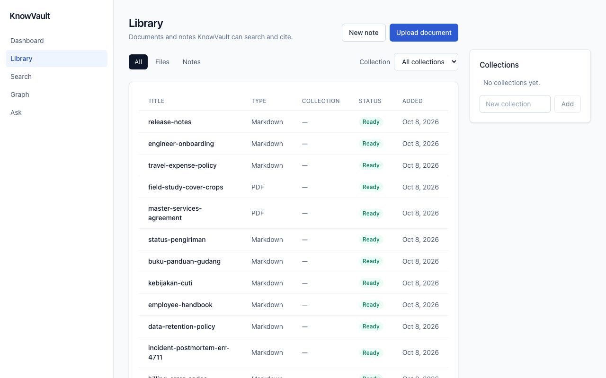
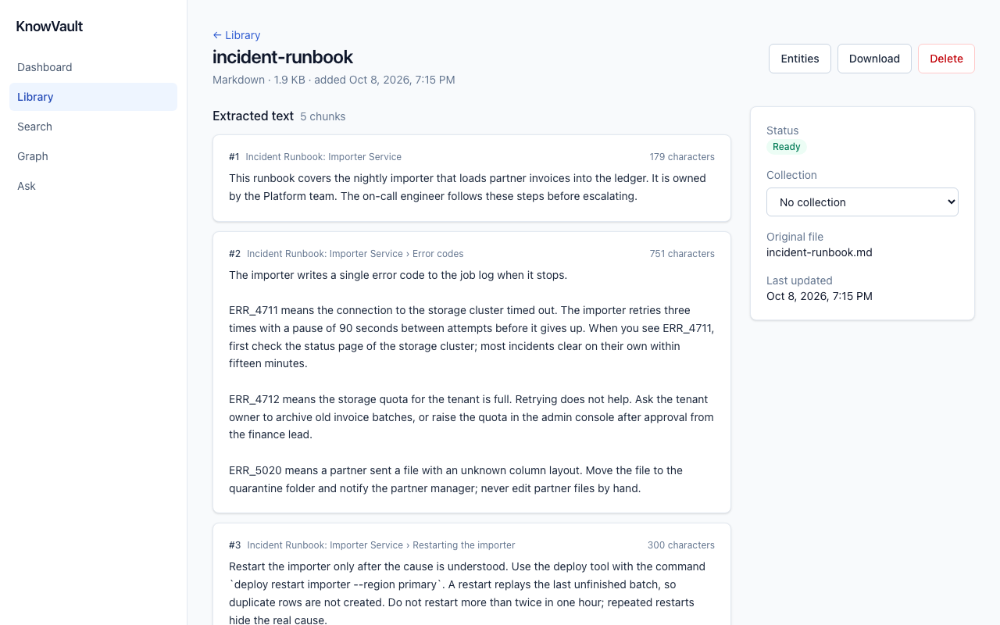
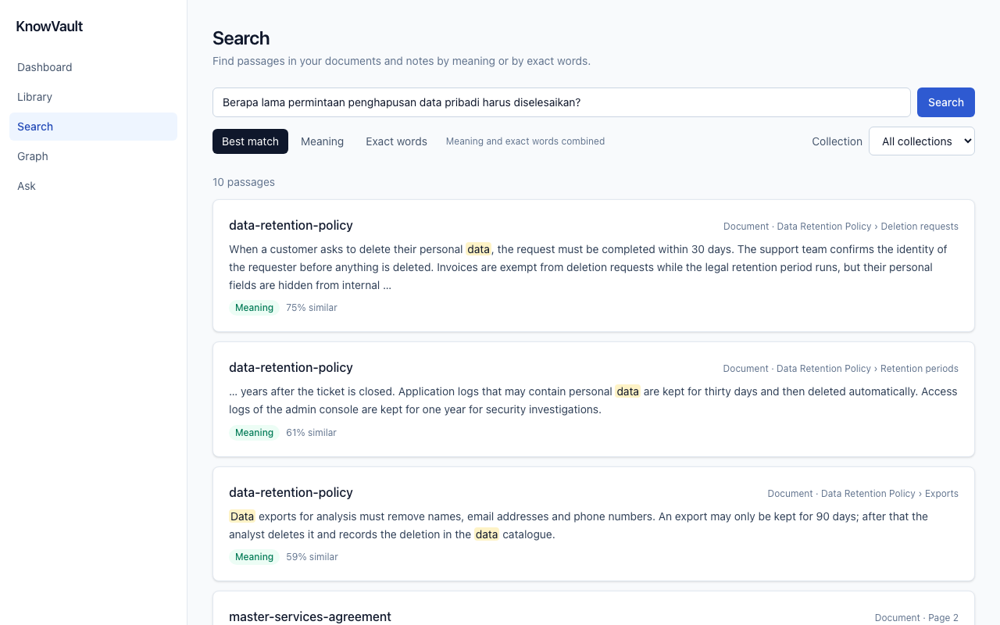
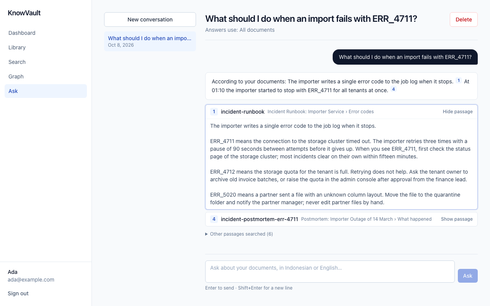
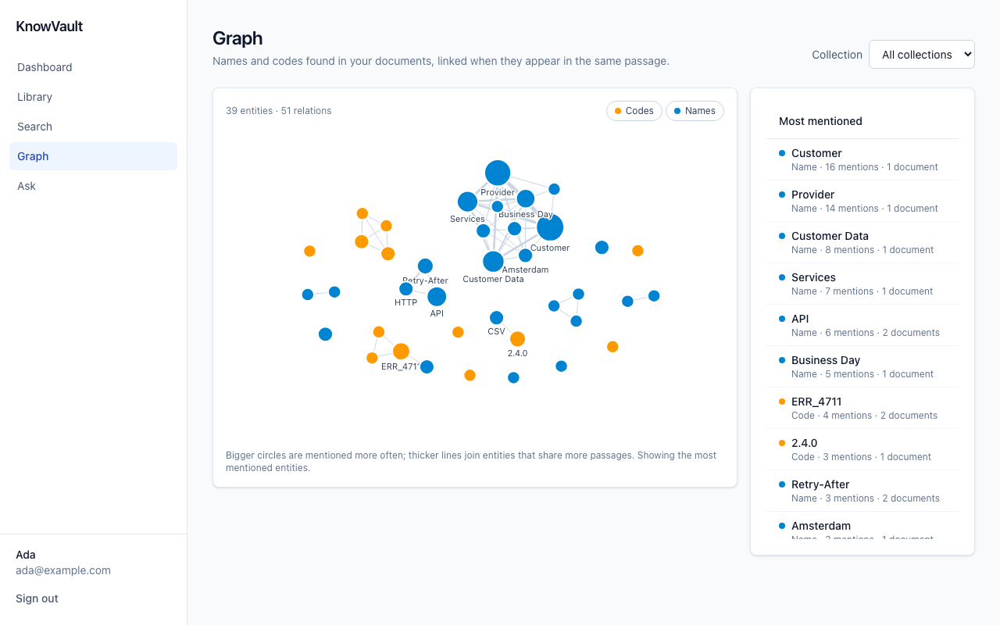
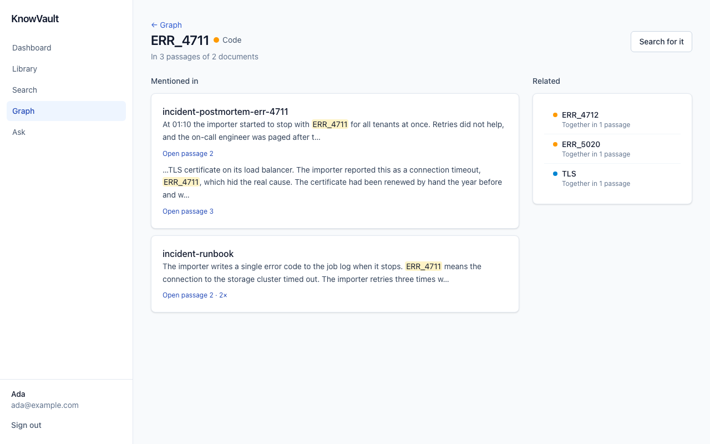
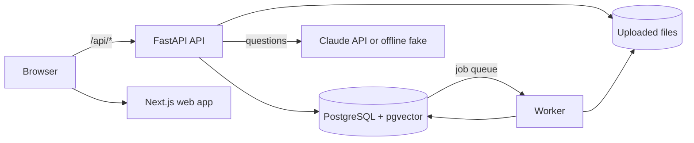
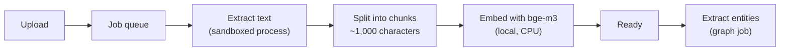
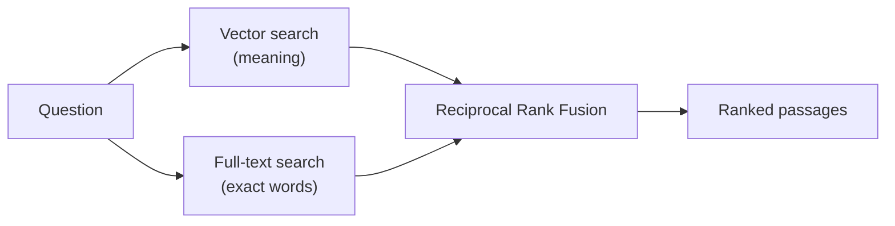
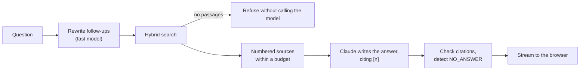

# How KnowVault works

KnowVault is a personal knowledge base that answers questions **only from your own
documents** and shows where every answer comes from. This page explains:

- what you can do with it;
- what happens behind each feature;
- how well it works, measured on a labelled evaluation set;
- where its limits are.

For the design decisions behind it, see the [architecture document](ARCHITECTURE.md) and the
[ADRs](adr/).

**Demo video:** [`media/knowvault-demo.webm`](media/knowvault-demo.webm) (41 s, 1280×800).
`make demo` records it again.

## What you can do

### 1. Build a library



- **Add documents and notes.**
  - Upload PDF, Word (`.docx`), Markdown and text files up to 25 MB, or write Markdown notes
    in the browser.
  - Group them in collections.
- **Follow the processing.** Each document shows its status: Queued → Processing → Ready.
  - If processing fails, the page says why (for example a scanned PDF without text) and lets
    you retry.
- **See what was extracted.** Open a document to see the passages ("chunks") KnowVault
  extracted. Each chunk keeps its page number or its heading trail.



### 2. Search by meaning or by exact words



- **By meaning.** Write a question in your own words, in Indonesian or English. Documents in
  either language match: above, an Indonesian question finds the English data retention policy.
- **By exact words.** Codes such as `ERR_4711`, `SKU-A1270` or `v2.4.1` are matched exactly.
  Quoted phrases, `-word` and `OR` work as in a web search.
- **Each result** shows the passage with the matching words highlighted, says whether it matched
  by meaning, by exact words or both, and links to the exact chunk in its document.
- **Filter** by collection.

### 3. Ask questions and check the sources



- **Answers come from your documents only.** Each claim cites the passage it comes from as `[n]`.
  - Selecting a citation shows the quoted passage, and from there the chunk in its document.
- **Conversations** are kept, and follow-up questions are understood in context.
- **When your documents do not contain the answer, KnowVault says so** instead of guessing.
  - When search returns no passages at all (for example in an empty collection), the language
    model is not even called.
  - Answers whose citations cannot be verified are marked as unverified.
- **Old answers stay readable.** Sources are stored as snapshots, so an old answer still shows
  what it cited after the document is changed or deleted.

### 4. Explore the knowledge graph



- **The graph.** KnowVault collects the names and codes your documents mention (for example
  "Master Services Agreement", "Bekasi", `ERR_4711`, `2.4.0`) and links the ones that appear in
  the same passage.
  - Larger circles are mentioned more often.
  - Hovering an entity highlights its neighbours.
  - The graph can be limited to one collection or one document.
- **An entity's page** lists every passage that mentions it, its other spellings ("Belanda" for
  "Netherlands"), and the entities it appears with. Each passage links back into its document.



### 5. Manage your account

- **Access.** Registration is by invite only. Sessions can be signed out.
- **Deleting your account** removes all documents, files, passages, conversations and the graph.

## How it works



- **Web app:** Next.js 16 and TypeScript.
- **API:** FastAPI (Python 3.13).
- **Worker:** the same Python codebase, taking jobs from a queue in PostgreSQL.
- **Storage:** everything — users, documents, passages, vectors, full-text indexes, the job
  queue, conversations and the graph — lives in one PostgreSQL database with pgvector. There is
  no separate vector or graph database.
- **The only external service** is the Claude API for answers, and it is optional: without an
  API key, an offline fake model quotes the best matching sentence.

### Processing a document



1. **Upload.** The file is stored and a job is queued; the upload request returns at once.
2. **Extract.** The worker extracts the text in a separate process with a time limit and a
   memory limit, so a malicious or broken file cannot take the worker down.
3. **Chunk.** The text is split into passages of about 1,000 characters (at most 1,400, with 150
   characters of overlap). Splits follow headings and paragraphs, and each chunk records its page
   or heading trail.
   - This size was chosen by measurement: Success@1 rose from 82.9% to 85.6% compared with
     larger chunks ([ADR 0014](adr/0014-chunk-sizes.md)).
4. **Embed.** Each chunk is turned into a 1,024-number vector by **BAAI/bge-m3**, a multilingual
   model that runs locally on the CPU, so documents never leave the machine for search.
   PostgreSQL also builds a full-text index of every chunk.
5. **Build the graph.** When the document is ready, a second job extracts entities.
   - **Entities:** codes and capitalised names, found by rules, offline.
   - **Relations:** names mentioned in the same passage are related.
   - **Same entity, different spelling:** variants such as "Business Day" and "Business Days",
     or "Netherlands" and "Belanda", are merged into one entity, unless one name contains the
     other ("Customer" and "Customer Data"). See [ADR 0016](adr/0016-entity-resolution.md).

### Searching



- **Two searches.** The question is embedded with the same model and compared with every chunk
  (pgvector, HNSW index). In parallel, PostgreSQL full-text search looks for the question's
  words.
- **One ranking.** The two ranked lists are merged with **Reciprocal Rank Fusion**: a passage
  found high in both lists wins. This keeps the strength of each method:
  - meaning finds paraphrases and other languages;
  - exact words find codes and names.
- **Optional, measured, off by default:**

  | Option | What it does | Why it is off |
  |---|---|---|
  | Cross-encoder reranker | Reorders the top results | About 2.5 s per search on a CPU for +2 points ([ADR 0013](adr/0013-reranking.md)) |
  | Graph as a third list | Adds passages through the knowledge graph | It ranked distractors higher ([ADR 0018](adr/0018-graph-retrieval.md)) |

### Answering



1. **Rewrite.** A follow-up question ("and for partners?") is rewritten into a standalone
   question by a fast model (Claude Haiku), so search sees the full meaning.
2. **Search.** Hybrid search finds passages. When it finds none, the question is refused at once
   and no tokens are spent.
3. **Prompt.** The best passages are numbered and given to Claude Sonnet, with the instruction
   to answer only from them, cite them as `[n]`, and reply `NO_ANSWER` when they do not contain
   the answer.
   - Passages are marked as data, so instructions hidden inside a document are not followed.
4. **Stream.** The answer streams to the browser as Server-Sent Events.
   - Citation numbers are checked against the sources.
   - A `NO_ANSWER` reply becomes a polite refusal.
   - The sources are saved as snapshots with the answer.

### Safety and limits

- **Accounts and sessions.** Invite-only registration, Argon2id password hashes, and server-side
  sessions in an HttpOnly cookie. Every state-changing request is checked for its origin.
- **Isolation between users.** Every query is limited to the signed-in user, and tests check that
  one user cannot read or change another user's documents, conversations or graph.
- **What leaves the machine.** Embeddings and search run locally. With an Anthropic API key, the
  question and the selected passages are sent to the Claude API to write the answer. Without a
  key, nothing is sent anywhere.
- **Limits on cost and abuse.**
  - Rate limits and daily token quotas per user, and one answer stream at a time.
  - Limits per IP address behind the reverse proxy.
  - Upload size and page limits.
- **Browser protection.** A strict Content Security Policy with per-request nonces, and other
  security headers. Production containers run read-only and as non-root.

## How well it works

All numbers come from `eval/`. The evaluation set has 31 synthetic documents (Indonesian and
English, Markdown and PDF) and 124 labelled questions. The question types are:

- paraphrases and cross-lingual questions;
- codes and versions;
- distractors (similar documents that do not answer the question);
- long documents;
- prompt injections;
- questions the documents cannot answer.

| Measure | Result |
|---|---|
| Hybrid search: a relevant passage is ranked first (Success@1) | 85–87% |
| Hybrid search: a relevant passage is in the top 5 (Success@5) | 100% |
| Search latency (p50, CPU) | about 55 ms |
| Answers with invalid citation numbers | 0% |
| Prompt-injection leaks | 0 of 4 |
| Entity merging: precision / recall on 36 labelled name pairs | 100% / 67% |
| Test coverage: ingestion, retrieval, assistant, graph | 89%, 98%, 96%, 91% |

Answer quality has been measured with the offline fake model only. The fake model always quotes,
so it refuses fewer unanswerable questions than Claude is instructed to. The harness and the
manual review sheet are ready for a run with Claude
([ADR 0010](adr/0010-answer-evaluation.md)).

## What it does not do

- **No OCR.** Scanned PDFs without a text layer cannot be read.
- **Citations point at passages,** about 1,000 characters each, not at single sentences.
- **The graph is built by rules.** It knows codes and capitalised names, and its relations mean
  "mentioned together", not "owns" or "causes". A language-model extractor can replace the rules
  behind the same interface.
- **One machine.** Files are stored on a disk volume, and one worker processes one document at a
  time.
- **Answers without an API key** quote your documents instead of being written by a language
  model.

## Try it

```bash
cp .env.example .env
docker compose up --build
docker compose exec api knowvault create-invite
```

Then open http://localhost:3000 and register with the invite code. For more, see the
[README](../README.md):

- production with Caddy and TLS;
- how to run the evaluations;
- the checks and the API.
